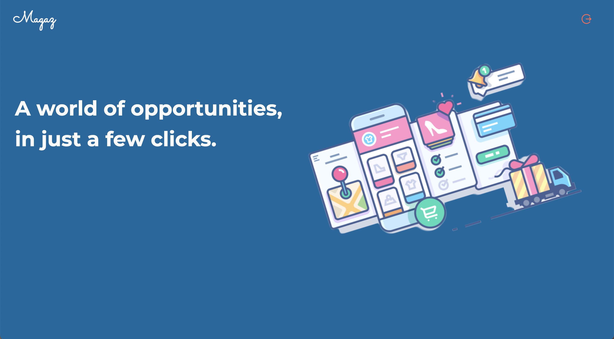
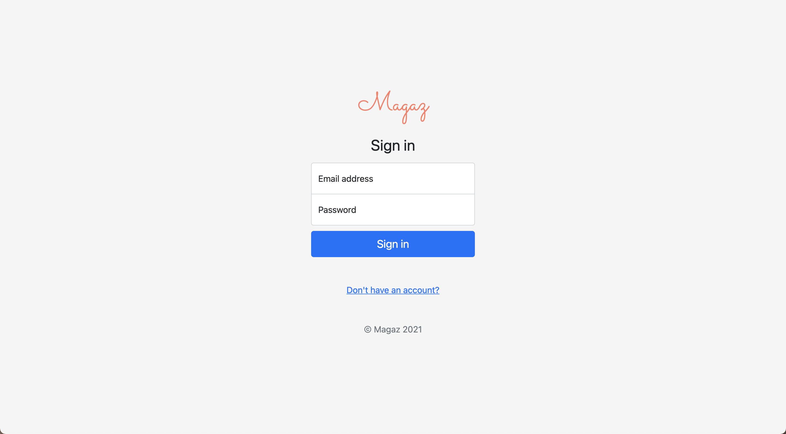
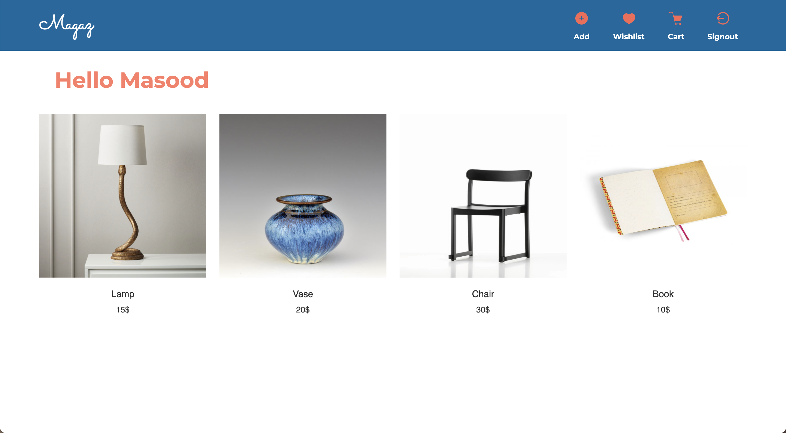
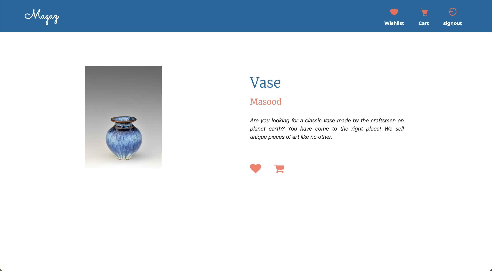
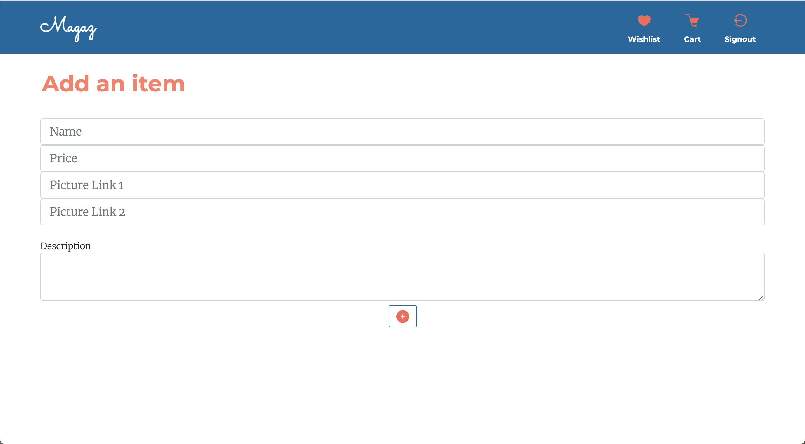
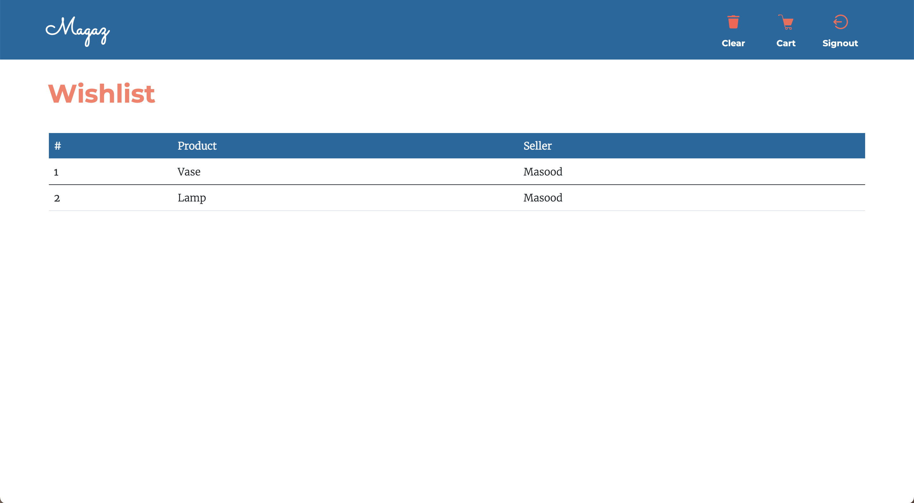

# Magaz 

Magaz is an E-commerce app built in Node.js. It provides the user with basic
functionalities of an online shop.

* **Browse** through all the present products in the database.
* **Create** an account if you don't have one.
* **Add** products to the global database.
* **Get** more info about the product by clicking on product's title.
* **Add** products to your wishlist or cart.
* **Clear** your wishlist or cart.

## Technologies used in this project:

 

---

  

With **signin** feature the users can sign in with their credentials.
**NOTE THAT THE AUTHENTICATION CODE IN THIS PROJECT HAS A LEVEL 1 SECURITY**
**AND SHOULD NOT BE BY ANY MEANS USED COMMERCIALLY**

  

When the user is **Authenticated** the name is displayed and different 
options are provided.

  

The user can **get** more info about a certain product by clicking 
on its title.

  

The user can **add** a product to the database by providing a name,
price,links to picture on the internet and a description.

  

The **wishlist** and **cart** options provide the user with the
ability to add a product.

  

---

## Note

Feel free to download the project and build upon it. You can add
new features, refactor the code if you'd like and improve 
the authentication. You will have a working E-commerce app to 
deploy on the web in no time. Happy coding!